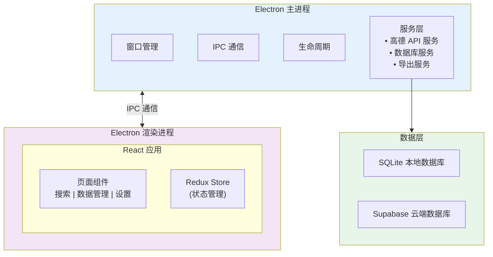

<div align="center">

# 🗺️ POI 数据采集器

**高效、智能的地理位置数据采集工具**

[](https://www.electronjs.org/)
[](https://reactjs.org/)
[](https://www.typescriptlang.org/)
[](LICENSE)

[功能特性](#-功能特性) • [快速开始](#-快速开始) • [技术架构](#-技术架构) • [使用指南](#-使用指南) • [开发文档](#-开发文档)

</div>

---

## 📖 项目简介

POI 数据采集器是一款基于 Electron + React 构建的跨平台桌面应用，专为高效采集和管理地理位置兴趣点（POI）数据而设计。通过集成高德地图开放平台 API，提供强大的数据采集、存储、管理和导出功能。

### ✨ 核心亮点

- 🚀 **高效采集** - 支持单次搜索和批量自动采集，智能分页处理
- 💾 **双模式存储** - 本地 SQLite + 云端 Supabase，数据安全可靠
- 🎯 **精准搜索** - 支持关键词、城市、POI 分类多维度筛选
- 📊 **数据管理** - 完善的数据查看、编辑、删除功能
- 📤 **灵活导出** - 支持 CSV 格式导出，兼容 Excel
- 🔑 **多 Key 管理** - 支持多个 API Key 轮换使用，避免额度限制
- 🎨 **现代 UI** - Material-UI 设计，流畅的用户体验

---

## 🎯 功能特性

### 核心功能模块

| 功能 | 描述 | 状态 |
|------|------|------|
| 🔍 **POI 搜索** | 支持关键词搜索和周边搜索，可按城市、分类筛选 | ✅ 已完成 |
| 📦 **批量采集** | 自动分页采集，支持断点续传和进度监控 | ✅ 已完成 |
| 💾 **数据存储** | 本地 SQLite + 云端 Supabase 双模式存储 | ✅ 已完成 |
| 📊 **数据管理** | 查看、搜索、编辑、删除已保存的 POI 数据 | ✅ 已完成 |
| 📤 **数据导出** | 导出为 CSV 格式，完美兼容 Excel | ✅ 已完成 |
| 🔑 **API Key 管理** | 支持多个 API Key，自动轮换和额度监控 | ✅ 已完成 |
| 🏙️ **城市编码管理** | 内置全国城市编码数据，支持导入和管理 | ✅ 已完成 |
| 🏷️ **POI 分类管理** | 完整的高德 POI 分类体系，支持导入和查询 | ✅ 已完成 |
| ⚙️ **设置管理** | 主题切换、分页设置、采集延迟等个性化配置 | ✅ 已完成 |

### 📚 数据资源

- 📋 [高德 POI 分类与编码](docs/amap_poi_typecode.csv) - 完整的 POI 分类体系
- 🏙️ [全国城市编码表](docs/amap_adcode_citycode.csv) - 全国行政区划代码
- 📖 [高德 API 文档](docs/amap-api.md) - API 接口说明

---

## 📸 应用界面

### 首页


<p align="center"><i>应用首页 - 数据统计概览</i></p>

### POI 搜索


<p align="center"><i>POI 搜索页面 - 支持关键词搜索和批量采集</i></p>

### 数据管理


<p align="center"><i>已保存 POI 数据管理页面</i></p>

### 关于页面


<p align="center"><i>关于项目 - 功能介绍和技术栈</i></p>

---

## 🚀 快速开始

### 环境要求

- **Node.js**: 22.x 或更高版本
- **npm**: 10.x 或更高版本
- **操作系统**: macOS 12.0+ / Windows 10+ / Linux

### 安装步骤

```bash
# 1. 克隆项目
git clone https://github.com/pbeenigg/poi_collector_app.git
cd poi_collector_app

# 2. 安装依赖
npm install

# 3. 启动开发模式
npm run dev
```

### 配置 API Key

1. 访问 [高德开放平台](https://lbs.amap.com/) 注册账号
2. 创建应用并获取 Web 服务 API Key
3. 在应用的「设置」页面添加 API Key

### 构建应用

```bash
# 构建所有平台
npm run build:all

# 仅构建 macOS
npm run build:mac

# 仅构建 Windows
npm run build:win

# 仅构建 Linux
npm run build:linux
```

构建产物位于 `release/` 目录。

---

## 🏗️ 技术架构

### 技术栈

<table>
<tr>
<td width="50%">

**前端技术**
- ⚛️ React 19.2.3
- 📘 TypeScript 5.3.0
- 🎨 Material-UI 6.1.0
- 🔄 Redux Toolkit 2.3.0
- 🎭 Framer Motion 12.x
- 🎨 SCSS + Tailwind CSS

</td>
<td width="50%">

**后端技术**
- 🖥️ Electron 28.3.3
- 💾 better-sqlite3 (SQLite)
- ☁️ Supabase (云端存储)
- 🌐 Axios (HTTP 客户端)
- 📦 electron-store (配置存储)
- 📝 Winston (日志系统)

</td>
</tr>
</table>

### 架构设计



### 数据模型

#### POI（兴趣点）

```typescript
interface POI {
  id: string;           // POI 唯一标识
  name: string;         // 名称
  type: string;         // 类型名称
  typeCode: string;     // 类型编码
  address: string;      // 地址
  location: string;     // 坐标 "经度,纬度"
  tel?: string;         // 电话
  pcode: string;        // 省份编码
  pname: string;        // 省份名称
  cityname: string;     // 城市名称
  adname: string;       // 区域名称
  adcode: string;       // 区域编码
  citycode: string;     // 城市编码
  parent?: string;      // 父级 POI
  distance?: string;    // 距离
}
```

#### POI 类别

```typescript
interface POICategory {
  id: string;
  code: string;         // 类别编码
  large: string;        // 大类
  medium: string;       // 中类
  small: string;        // 小类
  bigCategory: string;  // 大类(英文)
  midCategory: string;  // 中类(英文)
  subCategory: string;  // 小类(英文)
}
```

#### 城市编码

```typescript
interface CityCode {
  adcode: string;       // 行政区划编码
  name: string;         // 城市名称
  citycode: string;     // 城市编码
}
```

### 项目结构

```
poi_collector_app/
├── 📁 src/                          # 源代码目录
│   ├── 📁 main/                     # 主进程（Node.js 环境）
│   │   ├── 📄 index.ts              # 主进程入口
│   │   ├── 📁 ipc/                  # IPC 通信处理器
│   │   │   ├── poi-handler.ts       # POI 相关 IPC
│   │   │   ├── settings-handler.ts  # 设置相关 IPC
│   │   │   └── export-handler.ts    # 导出相关 IPC
│   │   ├── 📁 services/             # 业务服务层
│   │   │   ├── amap-service.ts      # 高德 API 服务
│   │   │   ├── db-service.ts        # SQLite 数据库服务
│   │   │   ├── db-service-supabase.ts # Supabase 数据库服务
│   │   │   └── export-service.ts    # 数据导出服务
│   │   └── 📁 utils/                # 工具类
│   │       ├── logger.ts            # 日志工具
│   │       └── config.ts            # 配置管理
│   │
│   ├── 📁 renderer/                 # 渲染进程（浏览器环境）
│   │   ├── 📄 index.tsx             # React 应用入口
│   │   ├── 📄 App.tsx               # 根组件
│   │   ├── 📁 pages/                # 页面组件
│   │   │   ├── HomePage.tsx         # 首页
│   │   │   ├── SearchPage.tsx       # POI 搜索页
│   │   │   ├── SavedPOIsPage.tsx    # 数据管理页
│   │   │   ├── CityCodesPage.tsx    # 城市编码管理页
│   │   │   ├── PoiTypeCodesPage.tsx # POI 分类管理页
│   │   │   ├── SettingsPage.tsx     # 设置页
│   │   │   └── AboutPage.tsx        # 关于页
│   │   ├── 📁 components/           # 通用组件
│   │   │   └── Layout/              # 布局组件
│   │   ├── 📁 store/                # Redux 状态管理
│   │   │   ├── index.ts             # Store 配置
│   │   │   ├── poiSlice.ts          # POI 状态
│   │   │   └── settingsSlice.ts     # 设置状态
│   │   ├── 📁 hooks/                # 自定义 Hooks
│   │   ├── 📁 styles/               # 样式文件
│   │   │   └── global.scss          # 全局样式
│   │   └── 📁 theme/                # 主题配置
│   │
│   ├── 📁 shared/                   # 主进程和渲染进程共享代码
│   │   ├── 📁 types/                # TypeScript 类型定义
│   │   │   └── poi.ts               # POI 数据类型
│   │   └── 📁 constants/            # 常量定义
│   │       └── ipc-channels.ts      # IPC 通道常量
│   │
│   └── 📁 preload/                  # 预加载脚本
│       └── 📄 index.ts              # 预加载入口（桥接主进程和渲染进程）
│
├── 📁 assets/                       # 静态资源
│   ├── 📁 data/                     # 数据文件
│   │   ├── amap_poi_typecode.csv    # POI 分类数据
│   │   └── amap_adcode_citycode.csv # 城市编码数据
│   └── 📁 images/                   # 图片资源
│
├── 📁 dist/                         # 构建输出目录
├── 📁 release/                      # 打包输出目录
├── 📄 package.json                  # 项目配置
├── 📄 tsconfig.json                 # TypeScript 配置
├── 📄 webpack.*.config.js           # Webpack 配置
└── 📄 README.md                     # 项目文档
```

---

## 📖 使用指南

### 基本使用流程

#### 1️⃣ 配置 API Key

```
设置页面 → 添加 API Key → 设置名称和每日额度 → 保存
```

支持添加多个 API Key，系统会自动轮换使用，避免单个 Key 超额度。

#### 2️⃣ 搜索 POI

**关键词搜索**
```
搜索页面 → 输入关键词（如"肯德基"）→ 选择城市 → 搜索
```

**批量采集**
```
搜索页面 → 点击"批量采集" → 设置筛选条件 → 开始采集
```

批量采集支持：
- 自动分页（最多 25 页）
- 进度实时显示
- 可随时停止
- 自动去重保存

#### 3️⃣ 数据管理

- **查看数据**：已保存 POI 页面查看所有采集的数据
- **搜索筛选**：支持按名称、地址、城市等字段搜索
- **编辑删除**：可对单条数据进行编辑或删除
- **批量操作**：支持批量删除

#### 4️⃣ 数据导出

```
已保存 POI 页面 → 导出 CSV → 选择保存位置
```

导出的 CSV 文件：
- ✅ 完美兼容 Excel
- ✅ 支持中文显示
- ✅ 包含所有字段信息

---

## 🛠️ 开发文档

### 可用脚本

```bash
# 开发
npm run dev              # 启动开发模式（热重载）
npm run dev:main         # 仅构建主进程（watch 模式）
npm run dev:renderer     # 仅启动渲染进程开发服务器
npm run dev:electron     # 仅启动 Electron

# 构建
npm run build            # 构建所有代码
npm run build:main       # 构建主进程
npm run build:preload    # 构建预加载脚本
npm run build:renderer   # 构建渲染进程

# 打包
npm run build:mac        # 打包 macOS 应用
npm run build:win        # 打包 Windows 应用
npm run build:linux      # 打包 Linux 应用
npm run build:all        # 打包所有平台

# 代码质量
npm run type-check       # TypeScript 类型检查
npm run lint             # ESLint 代码检查
npm run format           # Prettier 代码格式化
```

### 调试技巧

**主进程调试**
```bash
# 方法 1：使用 VS Code
按 F5 启动调试配置

# 方法 2：使用 Chrome DevTools
npm run dev:main
# 然后在 Chrome 中打开 chrome://inspect
```

**渲染进程调试**
```bash
# 在 Electron 窗口中
macOS: Cmd + Option + I
Windows/Linux: Ctrl + Shift + I
```

### 常见问题

<details>
<summary><b>Q: 如何解决 better-sqlite3 编译失败？</b></summary>

```bash
# 1. 安装编译工具
# macOS
xcode-select --install

# Windows
npm install --global windows-build-tools

# 2. 重新编译
npm run rebuild
```
</details>

<details>
<summary><b>Q: 如何配置 Supabase 云端存储？</b></summary>

1. 访问 [Supabase](https://supabase.com/) 创建项目
2. 获取项目 URL 和 API Key
3. 在应用设置页面配置 Supabase 连接
4. 切换到云端模式即可使用
</details>

<details>
<summary><b>Q: 批量采集失败怎么办？</b></summary>

检查以下几点：
- API Key 是否有效且未超额度
- 网络连接是否正常
- 搜索条件是否正确
- 查看日志文件获取详细错误信息
</details>

---

## 📝 更新日志

### v1.0.0 (2026-01-04)

#### ✨ 新功能
- 🎉 首次发布
- 🔍 POI 关键词搜索和周边搜索
- 📦 批量自动采集功能
- 💾 本地 SQLite + 云端 Supabase 双模式存储
- 📊 完整的数据管理功能
- 📤 CSV 格式数据导出
- 🔑 多 API Key 管理和自动轮换
- 🏙️ 全国城市编码数据管理
- 🏷️ POI 分类体系管理
- ⚙️ 丰富的个性化设置

#### 🐛 Bug 修复
- 修复 Mac 应用启动崩溃问题
- 修复批量采集保存失败问题（重复 ID 冲突）
- 修复 Webpack 打包配置问题
- 修复 Sass 弃用警告

#### 🔧 优化改进
- 优化批量采集性能
- 优化数据库查询效率
- 优化 UI 响应速度
- 优化错误提示信息

---

## 🤝 贡献指南

欢迎贡献代码、报告问题或提出建议！

### 贡献流程

1. Fork 本仓库
2. 创建特性分支 (`git checkout -b feature/AmazingFeature`)
3. 提交更改 (`git commit -m 'Add some AmazingFeature'`)
4. 推送到分支 (`git push origin feature/AmazingFeature`)
5. 开启 Pull Request

### 代码规范

- 遵循 ESLint 和 Prettier 配置
- 编写清晰的提交信息
- 添加必要的注释和文档
- 确保所有测试通过

---

## 📄 许可证

本项目采用 MIT 许可证 - 查看 [LICENSE](LICENSE) 文件了解详情。

---

## 🙏 致谢

- [Electron](https://www.electronjs.org/) - 跨平台桌面应用框架
- [React](https://reactjs.org/) - 用户界面库
- [Material-UI](https://mui.com/) - React UI 组件库
- [高德地图开放平台](https://lbs.amap.com/) - POI 数据来源
- [Supabase](https://supabase.com/) - 云端数据库服务

---

<div align="center">

**⭐ 如果这个项目对你有帮助，请给一个 Star！**

Made with ❤️ by [PbEeNiG]

</div>
