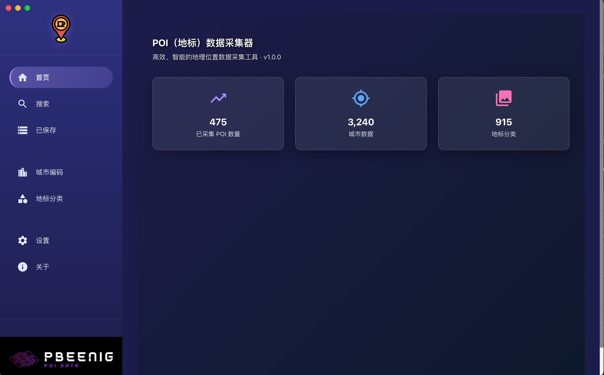
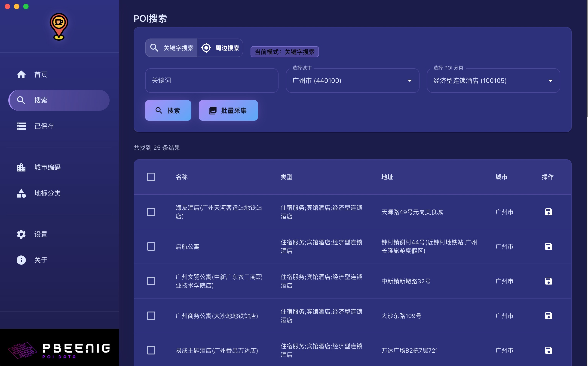
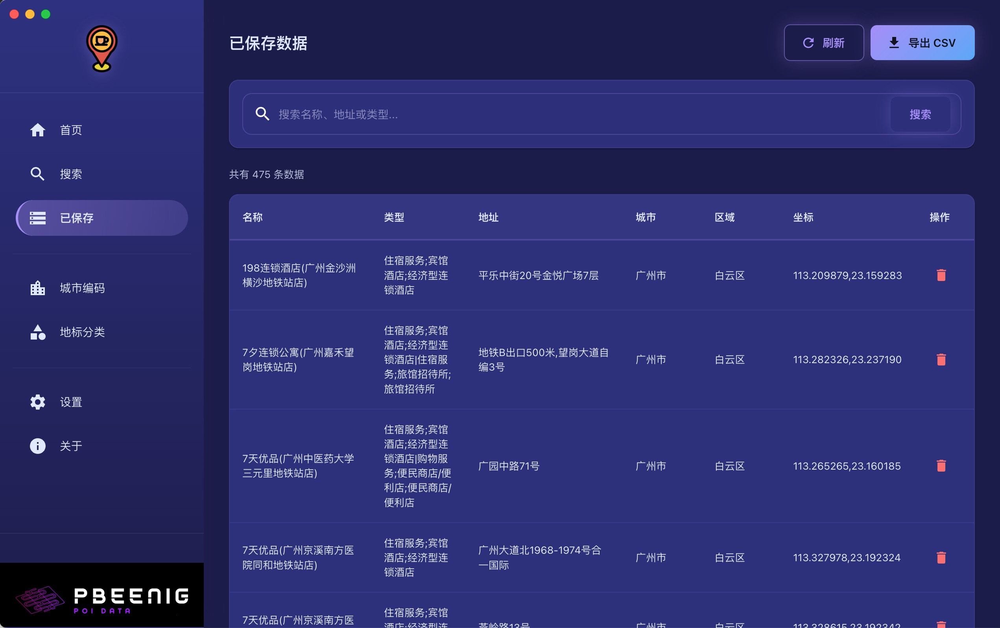
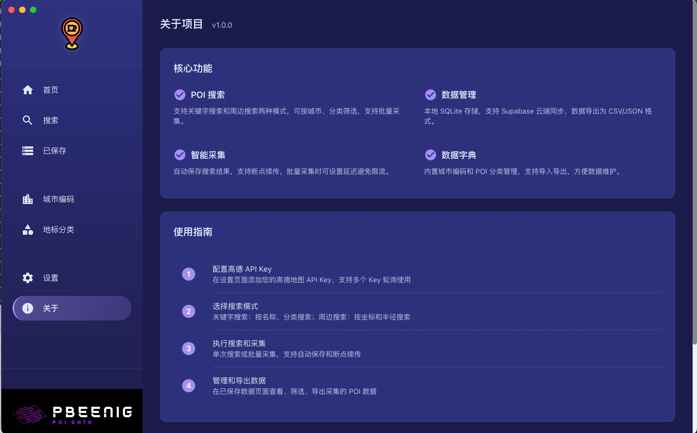

# 🎉 POI 数据采集器 v1.0.0 正式发布

<div align="center">


**高效、智能的地理位置数据采集工具**

[](https://www.electronjs.org/)
[](https://reactjs.org/)
[](https://www.typescriptlang.org/)

📅 **发布日期：2026-01-04**

[⬇️ 立即下载](https://github.com/pbeenigg/poi_collector_app/releases/tag/v1.0.0) | [📖 查看文档](https://github.com/pbeenigg/poi_collector_app) | [🐛 反馈问题](https://github.com/pbeenigg/poi_collector_app/issues)

</div>

---

## 📢 发布公告

我们很高兴地宣布 **POI 数据采集器 v1.0.0** 正式发布！

这是一款基于 **Electron + React** 构建的跨平台桌面应用，专为高效采集和管理地理位置兴趣点（POI）数据而设计。通过集成高德地图开放平台 API，为数据采集工作者、地理信息研究人员和开发者提供强大的数据采集、存储、管理和导出功能。

---

## ✨ 核心特性

### 🚀 高效数据采集

- **🔍 智能搜索**
  - 支持关键词搜索和周边搜索
  - 可按城市、POI 分类多维度筛选
  - 实时显示搜索结果和数据预览

- **📦 批量采集**
  - 自动分页采集，无需手动翻页
  - 支持断点续传和实时进度监控
  - 智能延迟控制，避免 API 限流

- **🔑 多 Key 管理**
  - 支持添加多个高德 API Key
  - 自动轮换使用，避免单个 Key 额度限制
  - 实时显示每个 Key 的使用统计

### 💾 双模式存储

- **本地存储**
  - 基于 SQLite 的高性能本地数据库
  - 支持离线使用，数据完全掌控
  - WAL 模式优化，提升并发性能

- **云端同步**
  - 集成 Supabase 云端数据库
  - 数据自动同步，多设备访问
  - 数据安全可靠，永不丢失

- **灵活切换**
  - 支持本地和云端模式自由切换
  - 一键切换，无缝迁移

### 📊 完善的数据管理

- **数据查看**
  - 支持分页浏览，高效加载大量数据
  - 搜索过滤，快速定位目标数据
  - 详情查看，完整展示 POI 信息

- **数据编辑**
  - 可编辑 POI 详细信息
  - 批量删除不需要的数据
  - 支持数据去重和清理

- **数据导出**
  - 支持 CSV 格式导出
  - 完美兼容 Excel 和其他数据分析工具
  - 自定义导出字段和格式

- **统计分析**
  - 实时显示数据统计
  - 采集进度可视化
  - 数据分布分析

### 🎨 现代化用户界面

- **Material-UI 设计**
  - 美观、专业的用户界面
  - 流畅的交互体验
  - 符合现代设计规范

- **响应式布局**
  - 适配不同屏幕尺寸
  - 支持窗口缩放
  - 优化的视觉效果

- **主题切换**
  - 支持明暗主题切换
  - 护眼模式，长时间使用更舒适
  - 个性化配置

- **动画效果**
  - 基于 Framer Motion 的流畅动画
  - 提升用户体验
  - 视觉反馈清晰

### 📚 丰富的数据资源

- **POI 分类体系**
  - 内置完整的高德 POI 分类与编码
  - 支持分类查询和筛选
  - 定期更新分类数据

- **城市编码数据**
  - 全国行政区划代码数据
  - 支持城市搜索和选择
  - 覆盖全国所有城市

- **API 文档**
  - 详细的高德 API 接口说明
  - 使用示例和最佳实践
  - 常见问题解答

---

## 🛠️ 技术栈

### 前端技术

| 技术 | 版本 | 说明 |
|------|------|------|
| ⚛️ React | 19.2.3 | 最新的 React 版本，性能更优 |
| 📘 TypeScript | 5.3.0 | 类型安全，提升代码质量 |
| 🎨 Material-UI | 6.1.0 | 专业的 UI 组件库 |
| 🔄 Redux Toolkit | 2.3.0 | 现代化的状态管理 |
| 🎭 Framer Motion | 12.x | 流畅的动画效果 |
| 🎨 SCSS + Tailwind | - | 灵活的样式解决方案 |

### 后端技术

| 技术 | 版本 | 说明 |
|------|------|------|
| 🖥️ Electron | 28.3.3 | 跨平台桌面应用框架 |
| 💾 better-sqlite3 | - | 高性能 SQLite 数据库 |
| ☁️ Supabase | - | 云端数据库服务 |
| 🌐 Axios | - | 强大的 HTTP 客户端 |
| 📦 electron-store | 8.2.0 | 安全的配置存储 |
| 📝 Winston | - | 专业的日志系统 |

### 构建工具

- 📦 Webpack 5 - 模块打包
- 🔧 Babel - JavaScript 编译
- 🎨 PostCSS - CSS 处理
- 🏗️ Electron Builder - 应用打包

---

## 📸 应用截图

### 首页 - 数据统计概览



### POI 搜索 - 关键词搜索和批量采集



### 数据管理 - 已保存 POI 数据



### 关于页面 - 功能介绍和技术栈



---

## 🐛 已修复的问题

本版本修复了开发过程中发现的多个重要问题：

### 稳定性修复

- ✅ **修复 Mac 应用启动崩溃问题**
  - 问题：electron-store 11.x 版本为纯 ES Module，导致 CommonJS 环境下无法加载
  - 解决：降级到 electron-store 8.2.0，支持 CommonJS

- ✅ **修复批量采集保存失败问题**
  - 问题：SQLite 和 Supabase 批量插入时出现重复 ID 冲突
  - 解决：在批量保存前添加数据去重逻辑

### 开发体验优化

- ✅ **修复开发环境 `global is not defined` 错误**
  - 问题：Webpack 5 在浏览器环境下缺少 global 变量
  - 解决：添加 DefinePlugin 配置，映射 global 到 window

- ✅ **修复开发环境 `require is not defined` 错误**
  - 问题：events 模块在浏览器环境下无法使用
  - 解决：配置 events polyfill，使用 browserify 版本

- ✅ **消除 Sass 弃用警告**
  - 问题：sass-loader 使用旧版 API 导致警告
  - 解决：配置 sass-loader 使用现代 API

### UI/UX 改进

- ✅ **修复批量采集弹框文字颜色过浅问题**
  - 问题：弹框中的文字对比度不足，影响可读性
  - 解决：调整文字颜色，提高对比度

---

## 🔧 性能优化

### 数据库优化

- ⚡ **启用 WAL 模式**
  - 提升并发性能
  - 减少锁定时间
  - 提高写入速度

- ⚡ **添加索引**
  - 为常用查询字段添加索引
  - 优化搜索性能
  - 加快数据加载速度

- ⚡ **批量操作优化**
  - 使用事务批量处理
  - 减少数据库 I/O
  - 提升批量保存效率

### UI 渲染优化

- ⚡ **使用 React.memo**
  - 减少不必要的组件重渲染
  - 提升页面响应速度
  - 降低 CPU 占用

- ⚡ **虚拟列表**
  - 大量数据渲染优化
  - 只渲染可见区域
  - 提升滚动流畅度

- ⚡ **懒加载**
  - 按需加载组件
  - 减少初始加载时间
  - 优化内存占用

### 网络请求优化

- ⚡ **请求队列**
  - 控制并发请求数量
  - 避免 API 限流
  - 提升采集稳定性

- ⚡ **智能延迟**
  - 自动调整请求间隔
  - 避免触发限流
  - 提高采集成功率

---

## 📦 支持平台

### macOS

- **系统要求**：macOS 12.0 或更高版本
- **架构支持**：Intel (x64) 和 Apple Silicon (arm64)
- **安装包格式**：
  - `.dmg` - 磁盘镜像文件（推荐）
  - `.zip` - 压缩包

### Windows

- **系统要求**：Windows 10 或更高版本
- **架构支持**：x64 和 ia32
- **安装包格式**：
  - `.exe` - 安装程序（推荐）
  - `Portable.exe` - 便携版


---

## 🚀 快速开始

### 1. 下载安装

访问 [Releases 页面](https://github.com/pbeenigg/poi_collector_app/releases/tag/v1.0.0) 下载适合您系统的安装包：

**macOS 用户**
```bash
# 下载 .dmg 文件后，双击打开
# 将应用拖拽到 Applications 文件夹
```

**Windows 用户**
```bash
# 下载 .exe 安装程序
# 双击运行，按照向导完成安装
```


### 2. 配置 API Key

1. 访问 [高德开放平台](https://lbs.amap.com/) 注册账号
2. 创建应用并获取 Web 服务 API Key
3. 在应用设置页面添加 API Key
4. 可添加多个 Key 实现自动轮换

### 3. 开始使用

**搜索 POI**
1. 在搜索页面输入关键词（如"餐厅"）
2. 选择城市（如"北京市"）
3. 可选择 POI 分类进行筛选
4. 点击搜索按钮查看结果

**批量采集**
1. 设置搜索条件
2. 点击"批量采集"按钮
3. 设置采集页数和延迟时间
4. 等待采集完成，数据自动保存

**数据管理**
1. 在"已保存"页面查看所有数据
2. 使用搜索框快速查找
3. 点击数据行查看详情
4. 可编辑或删除数据

**数据导出**
1. 在"已保存"页面点击导出按钮
2. 选择导出路径
3. 数据将导出为 CSV 格式
4. 可在 Excel 中打开查看

---

## 📖 文档资源

### 官方文档

- 📘 [完整使用文档](https://github.com/pbeenigg/poi_collector_app/blob/main/README.md)
- 🔧 [开发者文档](https://github.com/pbeenigg/poi_collector_app/blob/main/docs/DEVELOPMENT.md)
- 📝 [API 文档](https://github.com/pbeenigg/poi_collector_app/blob/main/docs/amap-api.md)

### 数据资源

- 📋 [高德 POI 分类与编码](https://github.com/pbeenigg/poi_collector_app/blob/main/docs/amap_poi_typecode.csv)
- 🏙️ [全国城市编码表](https://github.com/pbeenigg/poi_collector_app/blob/main/docs/amap_adcode_citycode.csv)

### 社区支持

- 🐛 [问题反馈](https://github.com/pbeenigg/poi_collector_app/issues)
- 💬 [讨论交流](https://github.com/pbeenigg/poi_collector_app/discussions)
- ⭐ [给个 Star](https://github.com/pbeenigg/poi_collector_app)

---

## 🙏 致谢

感谢以下开源项目和服务，让这个项目成为可能：

### 核心框架

- [Electron](https://www.electronjs.org/) - 跨平台桌面应用框架
- [React](https://reactjs.org/) - 用户界面库
- [TypeScript](https://www.typescriptlang.org/) - JavaScript 的超集

### UI 组件

- [Material-UI](https://mui.com/) - React UI 组件库
- [Framer Motion](https://www.framer.com/motion/) - 动画库
- [React Icons](https://react-icons.github.io/react-icons/) - 图标库

### 数据服务

- [高德地图开放平台](https://lbs.amap.com/) - POI 数据来源
- [Supabase](https://supabase.com/) - 云端数据库服务
- [better-sqlite3](https://github.com/WiseLibs/better-sqlite3) - SQLite 数据库

### 开发工具

- [Webpack](https://webpack.js.org/) - 模块打包工具
- [Babel](https://babeljs.io/) - JavaScript 编译器
- [ESLint](https://eslint.org/) - 代码检查工具
- [Prettier](https://prettier.io/) - 代码格式化工具

---

## 🤝 参与贡献

我们欢迎所有形式的贡献！

### 如何贡献

1. **报告问题**
   - 在 [Issues](https://github.com/pbeenigg/poi_collector_app/issues) 页面提交 Bug 报告
   - 提供详细的问题描述和复现步骤
   - 附上系统信息和错误日志

2. **提出建议**
   - 在 [Discussions](https://github.com/pbeenigg/poi_collector_app/discussions) 分享您的想法
   - 描述新功能的使用场景
   - 说明为什么这个功能有价值

3. **贡献代码**
   - Fork 本仓库
   - 创建特性分支 (`git checkout -b feature/AmazingFeature`)
   - 提交更改 (`git commit -m 'Add some AmazingFeature'`)
   - 推送到分支 (`git push origin feature/AmazingFeature`)
   - 开启 Pull Request

### 代码规范

- 遵循 ESLint 和 Prettier 配置
- 编写清晰的提交信息
- 添加必要的注释和文档
- 确保所有测试通过

---

## 📄 许可证

本项目采用 **MIT 许可证** - 查看 [LICENSE](LICENSE) 文件了解详情。

这意味着您可以：
- ✅ 商业使用
- ✅ 修改代码
- ✅ 分发软件
- ✅ 私人使用

前提是：
- 📝 保留版权声明
- 📝 包含许可证副本

---

## 📞 联系方式

如有任何问题或建议，欢迎通过以下方式联系：

- 📧 **Email**: [提交 Issue](https://github.com/pbeenigg/poi_collector_app/issues)
- 💬 **讨论**: [GitHub Discussions](https://github.com/pbeenigg/poi_collector_app/discussions)
- 🐛 **Bug 报告**: [GitHub Issues](https://github.com/pbeenigg/poi_collector_app/issues)

---

## 🎯 未来规划

我们正在计划以下功能和改进：

### v1.1.0 计划

- 🗺️ 支持地图可视化展示
- 📊 更丰富的数据统计和分析
- 🔄 数据同步优化
- 🌐 支持更多 POI 数据源
- 📱 移动端适配

### 长期规划

- 🤖 AI 辅助数据清洗
- 🔍 高级搜索和过滤
- 📈 数据可视化图表
- 🔌 插件系统
- 🌍 国际化支持

---

<div align="center">

## ⭐ 如果这个项目对您有帮助，请给一个 Star！

**Made with ❤️ by PbEeNiG**

[⬇️ 立即下载](https://github.com/pbeenigg/poi_collector_app/releases/tag/v1.0.0) | [📖 查看文档](https://github.com/pbeenigg/poi_collector_app) | [🐛 反馈问题](https://github.com/pbeenigg/poi_collector_app/issues)

---

**POI 数据采集器 v1.0.0** - 让数据采集更简单、更高效！

© 2026 POI Collector. All rights reserved.

</div>
